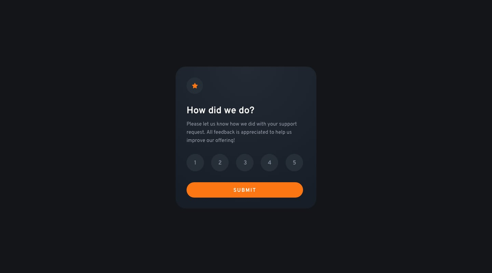

# Frontend Mentor - Interactive Rating Component Solution

This is a solution to the [Interactive Rating Component Challenge on Frontend Mentor](https://www.frontendmentor.io/challenges/interactive-rating-component-koxpeBUmI). Frontend Mentor challenges help you improve your coding skills by building realistic projects. 

## Table of Contents

- [Frontend Mentor - Interactive Rating Component Solution](#frontend-mentor---interactive-rating-component-solution)
  - [Table of Contents](#table-of-contents)
  - [Overview](#overview)
    - [The Challenge](#the-challenge)
    - [Screenshot](#screenshot)
    - [Links](#links)
  - [My Process](#my-process)
    - [Built With](#built-with)
    - [What I Learned](#what-i-learned)
    - [Continued Development](#continued-development)
    - [Useful Resources](#useful-resources)
  - [Author](#author)
  - [Acknowledgments](#acknowledgments)

## Overview

### The Challenge

Users should be able to:

- View the optimal layout for the app depending on their device's screen size
- See hover states for all interactive elements on the page
- Select and submit a number rating
- See the "Thank you" card state after submitting a rating

### Screenshot



I am using the images provided in the design folder for screenshot images. When I used my own screenshots they all had different sizes and warped the grid i had layed out on my homepage. The images provided in the design folder are close enough to what I have made to not notice the difference, and allow a more pleasing user experience.

Add a screenshot of your solution. The easiest way to do this is to use Firefox to view your project, right-click the page and select "Take a Screenshot". You can choose either a full-height screenshot or a cropped one based on how long the page is. If it's very long, it might be best to crop it.

Alternatively, you can use a tool like [FireShot](https://getfireshot.com/) to take the screenshot. FireShot has a free option, so you don't need to purchase it. 

Then crop/optimize/edit your image however you like, add it to your project, and update the file path in the image above.

### Links

- Solution URL: [Interactive Rating Component Solution](https://transcendent-kitsune-6a71ee.netlify.app/interactive%20rating%20component/)
- Live Site URL: [Front End Mentor Challenges](https://transcendent-kitsune-6a71ee.netlify.app/)

## My Process

### Built With

- Semantic HTML5 Markup
- CSS Custom Properties
- Flexbox
- Mobile-First Workflow
- JavaScript

### What I Learned

I found that I could use JavaScript to handle the sumbit function from my HTML form. I learned how to use Javascript to mainpulate HTML elements and what is displayed on my application.

HTML:
- the code snippet below uses the template tag which I learned will not show on the DOM or in the application until it is called to, which makes this perfect to use in this project.
```html
<template class="thankYouCardHolder">
  <div class="thankYouCard">
    
    <p class="ratingSelection">You selected {{ rating }} out of 5</p>
    <h2 class="thankYouHeader">Thank you!</h2>
    <p class="thankYouDescription">We appreciate you taking the time to give a rating. If you ever need more support, don't hesitate to get in touch!</p>
  </div>
</template>
```
CSS:
- I had a difficult time figuring out how to have a selector allow me to have a hover state and a checked state, and the code snippet below is what allowed me to do that.
```css
.ratingScale label:hover {
    color: rgb(49, 59, 68);
    background: hsla(84, 12%, 92%, 0.5);
}
input:checked + .control {
    color: rgb(250, 233, 202);
    background: rgb(236, 125, 53);
}
```
JavaScript:
- Besides the query selectors for the form, template, and wrapper the JS function below handles the form submit event. This function checks to see if there is a rating selected, and if there is a rating selected it takes the wrapper and replaces it's inner HTML with the what is in the template tag, and displays the rating that was selected.
```js
function handleSubmit(event) {
    event.preventDefault();
    const rating = new FormData(event.target).get("rating");
    if(rating) {
        wrapper.innerHTML = template.innerHTML.replace(/{{ rating }}/, rating);
    }
}

form.addEventListener("submit", handleSubmit);
```

If you want more help with writing markdown, we'd recommend checking out [The Markdown Guide](https://www.markdownguide.org/) to learn more.

### Continued Development

This project once again taught me a new HTML tag, which proves once more that I will always have more to learn and practice. I will continue to work on projects so I can continue levelling up my skills and knowledge. I had to find resources to help me work through the JavaScript, and I wish I was able to do it myself. I will have to continue working on projects like this to try and work through the JavaScript portions myself until it becomes as easy as the HTML is becoming.

### Useful Resources

- [Andreas Remdt YouTube](https://www.youtube.com/watch?v=j12yejW6v1M&t=3402s) - This video explained what I was doing wrong with the hover and checked states, and also showed me what I needed to do with my JavaScript.

## Author

- Portfolio - [Christopher J](https://clever-sunburst-739be9.netlify.app/)
- Frontend Mentor - [@ChristopherJ1987](https://www.frontendmentor.io/profile/ChristopherJ1987)

## Acknowledgments

Thanks to Chris Thompson who was my teacher at Coding Dojo Dallas, and whoever created Front End Mentor.

Thanks to Andreas Remdt who made the YouTube video that kept me moving forward and not staying stuck and frustrated.